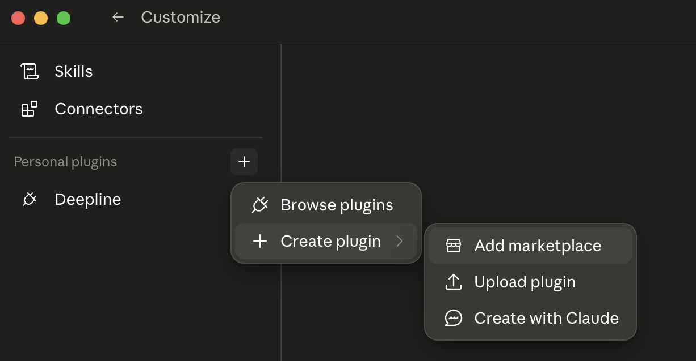
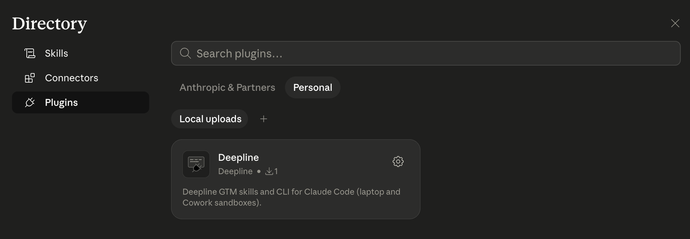
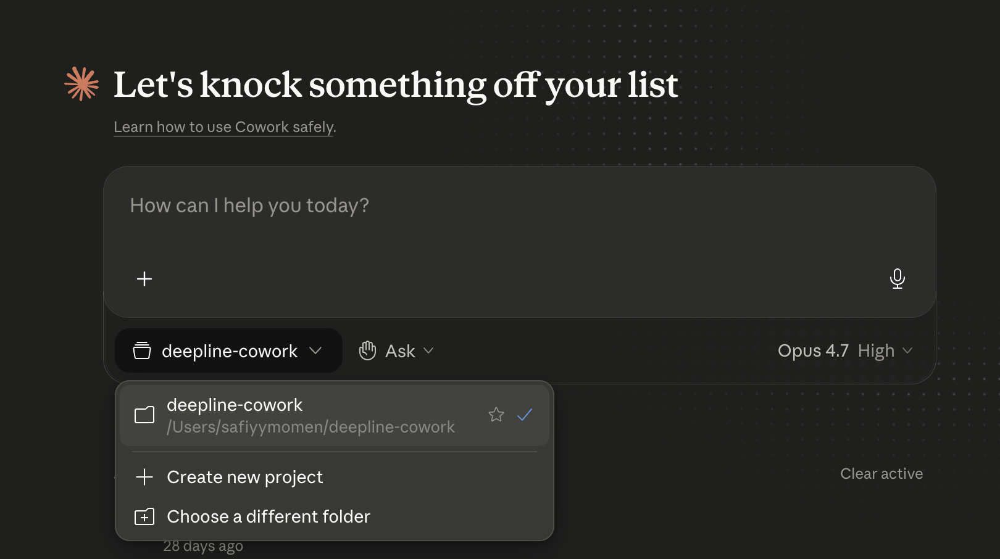
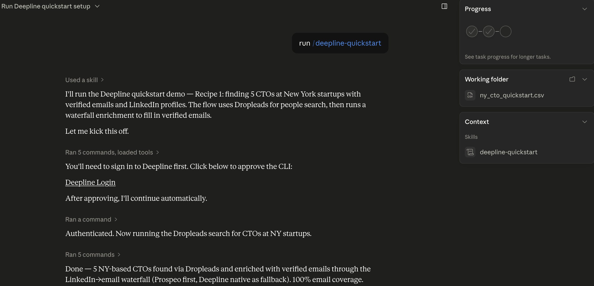

# Deepline Plugin

Deepline adds GTM skills and the `deepline` CLI to Claude Cowork and Claude Code.

Use it to build prospect lists, enrich CSVs, research accounts, write outbound, and run Deepline workflows from Claude.

## Install In Claude Cowork

In Cowork, add Deepline as a personal plugin:

1. Open Claude Desktop and switch to **Cowork**.
2. Open **Customize** in the left sidebar.
3. Click the **+** next to **Personal plugins**.
4. Open **Create plugin**, then choose **Add marketplace**.



5. Add a personal/custom plugin from this GitHub repository:

   ```text
   https://github.com/getaero-io/deepline-plugins
   ```

6. Install the `deepline` plugin.



7. Enable internet access for **all domains** in the Cowork session settings.
8. Start a Cowork session and select a project folder.



Selecting a folder lets Deepline persist auth in that workspace, so future Cowork sessions opened on the same folder can reuse the login.

9. Run:

   ```text
   /deepline-quickstart
   ```



The first Deepline command may install the canonical Deepline CLI inside the Cowork sandbox. That is expected.

Team and Enterprise plans: your organization owner may need to enable Cowork for the workspace. They may also need to allow internet access for all domains, or add the domains you use, in Cowork's network settings. See [Use Claude Cowork on Team and Enterprise plans](https://support.claude.com/en/articles/13455879-use-claude-cowork-on-team-and-enterprise-plans).

## Install In Claude Code

Inside Claude Code, run:

```text
/plugin marketplace add getaero-io/deepline-plugins
/plugin install deepline@deepline
/reload-plugins
```

Then try:

```text
/deepline-quickstart
```

## Auth

If Deepline asks you to authenticate:

```bash
deepline auth register --no-wait
```

Open the printed approval URL, approve it, then run:

```bash
deepline auth wait --timeout 120
deepline auth status
```

## Verify

Ask Claude to run:

```bash
command -v deepline
deepline --version
deepline auth status
```

## References

- [Deepline plugin repository](https://github.com/getaero-io/deepline-plugins)
- [Use plugins in Claude Cowork](https://support.claude.com/en/articles/13837440-use-plugins-in-claude-cowork)
- [Claude Code plugin docs](https://code.claude.com/docs/en/discover-plugins)

## License

MIT
