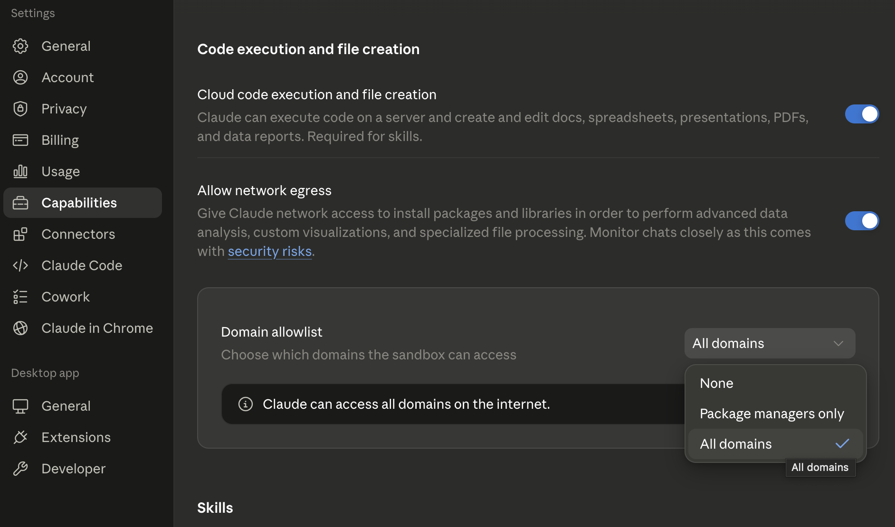

# Deepline Skills Plugin

Deepline adds GTM skills to Claude Cowork and Claude Code. Each installed skill includes the Deepline CLI setup commands, so the plugin is only a skills bundle.

Use it to build prospect lists, enrich CSVs, research accounts, write outbound, and run Deepline workflows from Claude.

## Install In Claude Cowork

In Cowork, add Deepline as a personal plugin:

1. Open Claude Desktop and switch to **Cowork**.
2. Open **Customize** in the left sidebar.
3. Click the **+** next to **Personal plugins**.
4. Open **Create plugin**, then choose **Add marketplace**.


5. Add a personal/custom plugin from this GitHub repository:

   ```text
   https://github.com/getaero-io/deepline-plugins
   ```

6. Install the `deepline` plugin.


7. Enable internet access for **all domains** in the Cowork session settings: open **Settings** -> **Capabilities**, turn on **Allow network egress**, then set **Domain allowlist** to **All domains**.



8. Start a Cowork session and select a project folder.


Selecting a folder lets Deepline persist auth in that workspace, so future Cowork sessions opened on the same folder can reuse the saved auth.

9. Run:

   ```text
   /deepline-quickstart
   ```


If the CLI is not installed yet, the skill will tell Claude to run:

```bash
npm install -g deepline
# Fallback for secure sandboxes: mkdir -p "$HOME/.local" && npm config set prefix "$HOME/.local" && export PATH="$HOME/.local/bin:$PATH" && npm install -g deepline --registry https://code.deepline.com/api/v2/npm/
deepline auth register --wait auto
deepline auth wait --timeout 120 # completes Cowork/browser approval; no-op if already connected
deepline auth status
deepline -h
```

Team and Enterprise plans: your organization owner may need to enable Cowork for the workspace. They may also need to allow internet access for all domains, or add the domains you use, in Cowork's network settings. See [Use Claude Cowork on Team and Enterprise plans](https://support.claude.com/en/articles/13455879-use-claude-cowork-on-team-and-enterprise-plans).

## Install In Claude Code

Inside Claude Code, run:

```text
/plugin marketplace add getaero-io/deepline-plugins
/plugin install deepline@deepline
/reload-plugins
```

Then try:

```text
/deepline-quickstart
```

On Claude Code the plugin bundles the CLI as a **standalone launcher**
(`deepline/bin/deepline`), which Claude Code adds to `PATH` automatically. On
first use it downloads and checksum-verifies the matching platform binary from
the `sdk-v<version>` release — **no `npm install -g` and no Node required**. See
[`deepline/bin/README.md`](deepline/bin/README.md).

If the bundled launcher is unavailable (e.g. an older plugin version), the skill
falls back to installing the CLI via npm:

```bash
npm install -g deepline
# Fallback for secure sandboxes: mkdir -p "$HOME/.local" && npm config set prefix "$HOME/.local" && export PATH="$HOME/.local/bin:$PATH" && npm install -g deepline --registry https://code.deepline.com/api/v2/npm/
deepline auth register --wait auto
deepline auth wait --timeout 120 # completes Cowork/browser approval; no-op if already connected
deepline auth status
deepline -h
```

## Auth

If Deepline asks you to authenticate:

```bash
deepline auth register --wait auto
deepline auth wait --timeout 120 # completes Cowork/browser approval; no-op if already connected
deepline auth status
deepline -h
```

`--wait auto` waits locally and returns after printing the approval link in
Cowork. `auth wait` is safe in both places.

## Verify

Ask Claude to run:

```bash
command -v deepline
deepline --version
deepline auth status
```

## References

- [Deepline plugin repository](https://github.com/getaero-io/deepline-plugins)
- [Use plugins in Claude Cowork](https://support.claude.com/en/articles/13837440-use-plugins-in-claude-cowork)
- [Claude Code plugin docs](https://code.claude.com/docs/en/discover-plugins)

## License

MIT
